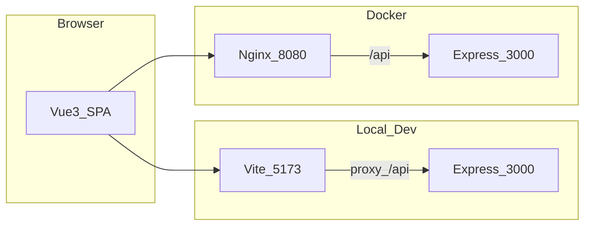

# 技术方案说明（毕设 / 工程化对照）

## 1. 系统架构

- **开发态**：Vite 提供 HMR，接口走 `/api` 代理到 Express。  
- **部署态**：多阶段 Dockerfile 构建静态资源，Nginx 托管并反代 API（见根目录 `Dockerfile`、`docker-compose.yml`）。

## 2. 技术选型

| 层次 | 技术 | 说明 |
|------|------|------|
| 视图 | Vue 3 + Composition API + TypeScript | 组件化与类型约束 |
| 构建 | Vite 7 | 开发服务器、打包、分包配置 |
| 路由 | Vue Router 4 | History 模式、懒加载、`beforeEach` 鉴权 |
| 状态 | Pinia 3 | 用户、购物车、语言、后台菜单等 |
| HTTP | axios | 统一实例、拦截器（见 `src/api/request.ts`） |
| UI | Element Plus（渐进） | 全局注册，登录页等逐步替换为 `el-*` |
| 测试 | Vitest + @vue/test-utils + v8 coverage | 工具函数 / Store / 组件冒烟 |
| 规范 | ESLint + Prettier + Husky + lint-staged | 提交前自动格式化与检查 |
| CI | GitHub Actions | lint → typecheck → test → build |
| Mock | MSW 2 | 可选，无后端时演示商品列表 |
| 后端 | Express + 内存数据 | 演示用，非生产持久化方案 |

## 3. 与「工业级清单」的对照与差异

| 清单项 | 本项目做法 |
|--------|------------|
| Element Plus / Naive UI | 已引入 **Element Plus**，采用**渐进替换**（先登录提交按钮等），避免全站一次性改版 |
| Husky / CI | 已配置 **lint-staged** 与 **GitHub Actions** |
| 单元测试 | 已建立 **Vitest** 用例与 **coverage-v8**；以高价值模块为主，不追求覆盖率数字 |
| Mock 并行开发 | **MSW** 可选开启；默认仍连真实后端，便于联调 |
| 国际化数字/日期 | 使用 `Intl` 封装 `formatCurrency` / `formatDateTime`（`src/utils/formatLocale.ts`） |
| 数据库 | 后端当前为**内存存储**；若演进可接 MySQL 等（见 README 与接口文档） |

## 4. 安全与边界（答辩建议主动说明）

- 演示账号明文密码、Token 存 `localStorage` 仅用于毕设。  
- 管理权限需**后端校验**；前端隐藏菜单不等于安全。  
- 内存数据重启后会话与购物车等会丢失，与持久化数据库方案不同。

## 5. 目录与扩展阅读

- [API.md](API.md) 接口表  
- [DEPLOY.md](DEPLOY.md) 部署与排错  
- 根目录 [README.md](../README.md) 总览
